# OpenText IDOL Docker Deployment

Deploy OpenText Knowledge Discovery (IDOL) in minutes with this Docker-containerized solution. Built for development, demos, and lab environments, it combines automated setup scripts with enterprise-grade security — transforming a typically complex deployment into a streamlined, guided operation.

---

## Table of Contents

- [Overview](#overview)
- [Key Features](#key-features)
- [Architecture & Components](#architecture--components)
- [Prerequisites](#prerequisites)
  - [Hyperscaler / Remote Linux Instance — Inbound Ports](#hyperscaler--remote-linux-instance--inbound-ports)
- [Installation Guide](#installation-guide)
  - [Phase 1 — WSL Environment Setup](#phase-1--wsl-environment-setup)
  - [Phase 2 — System Dependencies](#phase-2--system-dependencies)
  - [Phase 3 — Download IDOL License Server](#phase-3--download-idol-license-server)
  - [Phase 4 — Clone & Deploy Setup UI](#phase-4--clone--deploy-setup-ui)
  - [Phase 5 — UI Configuration (config-idol)](#phase-5--ui-configuration-config-idol)
  - [Phase 6 — Deploy IDOL Services](#phase-6--deploy-idol-services)
- [Custom Configuration](#custom-configuration)
- [Local LLM Integration](#local-llm-integration)
  - [How It Works — IDOL + LLM (RAG)](#how-it-works--idol--llm-rag)
    - [Summary — Why IDOL (Knowledge Discovery) + LLM, Together](#summary--why-idol-knowledge-discovery--llm-together)
  - [Step 0 — Validate Ollama & Hardware (ollama-verify.sh)](#step-0--validate-ollama--hardware-ollama-verifysh)
  - [Step 1 — Deploy Ollama](#step-1--deploy-ollama)
  - [Step 2 — Pull a Model](#step-2--pull-a-model)
  - [Step 3 — Configure IDOL Answer Server](#step-3--configure-idol-answer-server)
  - [Step 4 — Connect via NiFi Pipeline](#step-4--connect-via-nifi-pipeline)
  - [Step 5 — Test the Integration](#step-5--test-the-integration)
  - [Model Recommendations](#model-recommendations)
- [Rich Media Processing](#rich-media-processing)
  - [How It Works — IDOL + Rich Media Pipeline](#how-it-works--idol--rich-media-pipeline)
  - [Deploy IDOL Media Server](#deploy-idol-media-server)
  - [Summary of Parameters](#summary-of-parameters)
- [NiFi Manager Configuration](#nifi-manager-configuration)
  - [NiFi & GitHub Connection](#nifi--github-connection)
  - [Import NiFi Flows](#import-nifi-flows)
  - [Parameter Contexts](#parameter-contexts)
  - [Controller Services](#controller-services)
- [Troubleshooting](#troubleshooting)
  - [Remove All Running Containers](#remove-all-running-containers)
  - [Verify Extra SAN IP in NiFi Certificate](#verify-extra-san-ip-in-nifi-certificate)
- [Acknowledgments](#acknowledgments)
- [License](#license)

---

## Overview

This repository eliminates the manual configuration burden through intelligent automation, pre-configured templates, and Docker Compose orchestration — allowing teams to focus on exploring IDOL's capabilities rather than wrestling with infrastructure setup.

---

## Key Features

- ⚡ **Guided Deployment** — Step-by-step UI walks you through the full setup
- 🛠️ **Intuitive Web UI** — Browser-based configuration interface on port 5000
- 🔒 **Enterprise Security** — Built-in SSL certificate generation and best practices
- 📦 **Pre-Configured Templates** — Battle-tested default configurations
- 🚀 **Demo-Ready** — Perfect for POCs and development environments
- 🐳 **Docker Orchestration** — Simplified multi-container management
- 🤖 **Local LLM / RAG** — Integrate Ollama for on-premise AI answers grounded in your IDOL index

---

## Architecture & Components

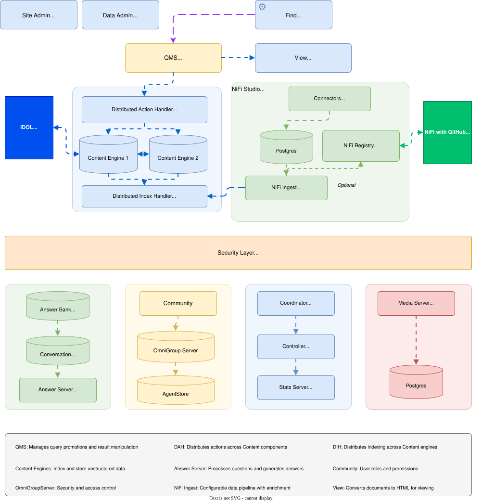
*Diagram 1: IDOL Setup Configuration Interface*

### Core Components

| Component | Description | Port |
|---|---|---|
| **IDOL Content Server** | Core search and analytics engine | Various |
| **IDOL Answer Server** | RAG orchestration — bridges IDOL and LLM | 12000 |
| **IDOL License Server** | License management and validation | Various |
| **NiFi Registry** | Data flow versioning with GitHub integration | Various |
| **Setup Manager UI** | Web-based configuration interface | 5000 |
| **Ollama** | Local LLM inference engine (RAG backend) | 8888 |
| **Docker Compose** | Container orchestration layer | N/A |

---

## Prerequisites

### System Requirements

| Component | Requirement | Notes |
|---|---|---|
| **Operating System** | Ubuntu 24.04 LTS | Tested configuration |
| **CPU** | 12+ cores | Recommended for POC |
| **Memory** | 64 GB RAM | Minimum for full deployment |
| **Storage** | 50+ GB disk space | SSD recommended |
| **Network** | Internet connectivity | For Docker image pulls |

### Required Software

The following packages are installed during Phase 2 of this guide:

- Docker Engine (≥ 24.04) + Docker Compose (≥ 2.0)
- Java Runtime Environment (OpenJDK 21)
- OpenSSL
- `jq`

### Access & Credentials

- ✅ **System Access** — Root or sudo privileges
- ✅ **IDOL License** — Valid `licensekey.dat` file
- ✅ **Docker Hub** — Personal access token for IDOL images
- ✅ **Network Access** — Outbound HTTPS for image pulls

### Hyperscaler / Remote Linux Instance — Inbound Ports

> **Required when deploying on a remote Linux instance hosted on a hyperscaler** (AWS, Azure, GCP, etc.).

Open the following **inbound TCP** rules in your cloud security group / network security group / firewall so that the Setup Manager UI and IDOL services are reachable from your workstation and from each other.

**idol-demo-UI** (protocol — TCP)

| Ports |
|---|
| 5000, 8002-8003, 8440, 8443-8445 |

**idol-demo-services** (protocol — TCP)

| Ports |
|---|
| 9000-9199, 12000-12320, 16000-16002, 19870-19880, 20050-20052 |

**idol-monitoring** (protocol — TCP)

| Ports |
|---|
| 5001-5020 |

> After applying the rules, verify connectivity from your client machine (e.g. `curl -k https://<PUBLIC_IP>:8443` or open `http://<PUBLIC_IP>:5000/config-idol` in a browser).

### WSL2 Performance Tuning (Windows Users)

<details>
<summary>⚠️ <strong>Optional</strong> — Skip this phase if you’re already on native Linux and proceed to the next step.</summary>
For optimal performance, configure `%UserProfile%\.wslconfig` on Windows before starting:

```ini
[wsl2]
macAddress=<<<YOUR IDOL MAC ADDRESS HERE>>>
memory=40GB
processors=14
swap=8GB
localhostForwarding=true
vmIdleTimeout=300000

[experimental]
autoMemoryReclaim=gradual
sparseVhd=true
dnsTunneling=true
```

After saving, restart WSL2:

```powershell
wsl --shutdown
```

Then reopen Docker Desktop and verify:

```powershell
wsl --exec free -h       # Should show ~40GB
wsl -l -v                # List distributions
docker ps                # Confirm Docker is running
```

> **Resources:** [WSL2 Docs](https://learn.microsoft.com/en-us/windows/wsl/) · [Docker Desktop WSL2 Backend](https://docs.docker.com/desktop/wsl/)
</details>

---

## Installation Guide

### Phase 1 — WSL Environment Setup

<details>
<summary>⚠️ <strong>Optional</strong> — Skip this phase if you’re already on native Linux and continue to Phase 2.</summary>

> Run all commands in **Windows PowerShell or Command Prompt (as Administrator)**.

#### 1.1 — Create a new WSL Ubuntu distribution

```powershell
wsl --install --name <Distribution Name>
```

When prompted, create a default Unix user account (e.g., `demo`) and set a password.
Exit the Linux shell by running:
```bash
exit
```

#### 1.2 — Grant the user sudo privileges

```powershell
wsl -d <Distribution Name>
```

Inside the WSL terminal:

```bash
sudo usermod -aG sudo <User Name>
exit
```

#### 1.3 — Switch to root and update packages

```powershell
wsl -d <Distribution Name> -u root
```

Inside the WSL terminal as root:

```bash
sudo apt update && sudo apt upgrade -y
```
</details>

---

### Phase 2 — System Dependencies

> If using WSL run all commands inside the WSL terminal as **root** (`wsl -d PlatoKD -u root`).

#### 2.1 — Install Docker Engine

```bash
# Install required tools
sudo apt install -y ca-certificates curl gnupg

# Add Docker's official GPG key
sudo install -m 0755 -d /etc/apt/keyrings
curl -fsSL https://download.docker.com/linux/ubuntu/gpg \
  | sudo gpg --dearmor -o /etc/apt/keyrings/docker.gpg

# Add Docker's APT repository
echo \
  "deb [arch=$(dpkg --print-architecture) signed-by=/etc/apt/keyrings/docker.gpg] \
  https://download.docker.com/linux/ubuntu \
  $(. /etc/os-release && echo $VERSION_CODENAME) stable" \
  | sudo tee /etc/apt/sources.list.d/docker.list > /dev/null

# Install Docker packages
sudo apt update
sudo apt install -y \
  docker-ce \
  docker-ce-cli \
  containerd.io \
  docker-buildx-plugin \
  docker-compose-plugin
```

#### 2.2 — Enable Docker and verify

```bash
sudo systemctl enable --now docker
docker --version
docker compose version
```

#### 2.3 — Run Docker without sudo

```bash
sudo usermod -aG docker <User Name>
newgrp docker
```
<details>
<summary>⚠️ <strong>Note for failing <code>newgrp docker</code> command</strong></summary>

If you receive the following message while executing the `newgrp docker` command:

Command 'newgrp' not found, but can be installed with: apt install util-linux-extra

Install the required package by running:

```bash
sudo apt install util-linux-extra
```

After the installation completes, rerun:

```bash
newgrp docker
```
</details>

#### 2.4 — Install Java Runtime Environment (OpenJDK 21)

```bash
sudo apt install -y openjdk-21-jdk
java -version
```

#### 2.5 — Install OpenSSL

```bash
sudo apt install -y openssl
openssl version
```

#### 2.6 — Install `jq`

```bash
sudo apt-get install -y jq
```

#### 2.7 — Fix Docker credential store for WSL

<details>
<summary>⚠️ <strong>Optional</strong> — Skip this step if you’re already on native Linux, and proceed to the next step.</summary>
Exit the root terminal session by running:

```bash
exit
```

By default, Docker on WSL writes a Windows-specific credential helper that causes failures. Remove it:

```bash
# Edit the Docker config
nano ~/.docker/config.json
```

Remove the following line (or delete the file if it only contains this):

```json
{
  "credsStore": "desktop.exe"   ← delete this line
}
```

Then log out of Docker:

```bash
docker logout
```
</details>
  
#### 2.8 — Configure a Docker mirror/registry

<details>
<summary>⚠️ <strong>Optional</strong> — Skip this step if there are no Docker registry issues, and proceed to the next step.</summary>
Edit or create /etc/docker/daemon.json:
```json
{
  "registry-mirrors": [
    "https://mirror.gcr.io",
    "https://registry.hub.docker.com"
  ]
}
```

Then restart Docker:
```bash
sudo systemctl restart docker
```
</details>

#### 2.9 — Enable WSL Integration in Docker Desktop

<details>
<summary>⚠️ <strong>Optional</strong> — Skip this step if you are not enabling WSL Integration in Docker Desktop, and proceed to the next step.</summary>
> Open Docker Desktop in Windows.
  - Go to Settings → Resources → WSL integration
  - Enable “Integration with my default WSL distro”
  - Enable your target distro, for example **<Distribution Name>**
  - Click Apply and restart Docker  
</details>
---

### Phase 3 — Download IDOL License Server

> Complete this step **before** opening the Setup Manager UI. The license server binary and key file must be in place so that their paths can be referenced in [Phase 4, Section 4.3](#43--idol-license-server).

#### 3.1 — Download the IDOL License Server package

Obtain the IDOL License Server installer for Linux x86_64 from the [OpenText Software Downloads portal](https://myaccount.opentext.com/). The package is typically named:

```
LicenseServer_27.x.x_LINUX_X86_64
```

#### 3.2 — Copy the package and license key into WSL

Use **VS Code** to copy both the License Server binary folder and your `licensekey.dat` file directly into your WSL home directory.

##### Main method: Using VS Code (drag & drop)

If you have **VS Code** with the **Remote – WSL** extension installed, you can copy the files from Windows into your WSL environment using VS Code’s built‑in file explorer.

##### 3.2.1. **Open your WSL distribution in VS Code**  
   - Launch VS Code.  
   - Press `Ctrl+Shift+P` to open the command palette, type `WSL: Connect to WSL`, and select your distribution (e.g., `Ubuntu`).  
   - Alternatively, run `code .` from within your WSL terminal to open the current directory in VS Code.

##### 3.2.2. **Reveal the Windows files**  
   - In VS Code’s Explorer (`Ctrl+Shift+E`), click **“Open Folder”** and navigate to the Windows folder containing `LicenseServer_25.x.x_LINUX_X86_64` and `licensekey.dat`.  
   - You can also drag the folder directly from Windows File Explorer into the VS Code sidebar.

##### 3.2.3. **Copy to the WSL home directory**  
   - In the VS Code Explorer, **right‑click** on `LicenseServer_25.x.x_LINUX_X86_64` and select **Copy**.  
   - Navigate to `/<License Server Downloaded Folder>/` in the Explorer.  
   - **Right‑click** inside that folder and select **Paste**.  
   - Repeat the same steps for `licensekey.dat`.

##### 3.2.4. **Verify**  
   - Open a WSL terminal (`Terminal > New Terminal` in VS Code) and run:
     ```bash
     ls ~/
     
#### 3.3 — Fix file permissions in WSL

In your WSL terminal, make the License Server binaries executable:

```bash
cd <IDOL to LicenseServer parent folder> 
sudo chmod +x LicenseServer_25.x.x_LINUX_X86_64/*
```

#### 3.4 — Update the License Server client configuration

Edit `idol.common.cfg` inside the License Server folder to allow connections from any host:

```bash
nano LicenseServer_25.x.x_LINUX_X86_64/idol.common.cfg
```

Change:

```ini
LicenseServerHost=localhost
Clients=localhost
```

to:

```ini
LicenseServerHost=licenseserver
Clients=*.*.*.*
```

> **Note:** The paths set here (`~/LicenseServer_25.x.x_LINUX_X86_64` and `~/licensekey.dat`) are the values you will enter in **Phase 4 → Section 4.3 — IDOL License Server**.

---

### Phase 4 — Clone & Deploy Setup UI

> Open a **guest WSL terminal** (as your regular user, e.g., `demo`).

#### 4.1 — Clone the repository

```bash
git clone https://github.com/oattia-ot/idol-docker-setup.git
cd idol-docker-setup/
```

#### 4.2 — Deploy the Setup Manager UI

```bash
cd utilities/ui-config
./deploy-setup-manager-ui.sh --deploy
```

This starts a local web server on **port 5000**.

---

### Phase 5 — UI Configuration (config-idol)

> Open your browser and navigate to: **http://localhost:5000/config-idol** (or the URL displayed after running the deploy script).

The **IDOL Deployment Setup Manager** is a clean, guided wizard. Complete the sections in order:

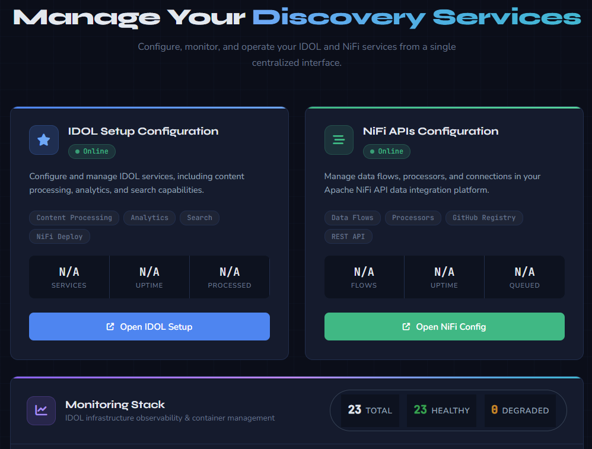
*Screenshot: Main Setup Manager dashboard — IDOL Setup Configuration, NiFi APIs Configuration, and Monitoring Stack*

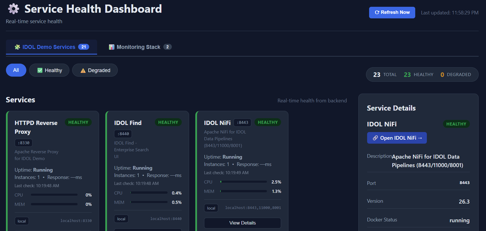
*Screenshot: Service Health Dashboard opened by pressing the Open Monitor button from the Monitoring Stack — real-time health status of all IDOL Demo Services (23 healthy, 0 degraded)*

#### 5.1 — Basic Configuration
- Enter the **IDOL Host FQDN** (your machine’s fully qualified hostname).
- Set the **Base Path** where the IDOL Docker setup will be installed.
- Select the desired **IDOL Server Version**.
- Choose your **Deployment Types**:
  - **Basic IDOL** — Core deployment with essential services (recommended)
  - **Data Admin IDOL** — Advanced administration, Answer Server, and additional features
  - **Rich Media** — Multimedia processing capabilities (optional)

**If Data Admin IDOL is selected:**
- Configure LLM Integration, LLM-Wiki, and GPU Acceleration options.
- Provide your Hugging Face token (if downloading models).
- Select the desired Answer Server model.

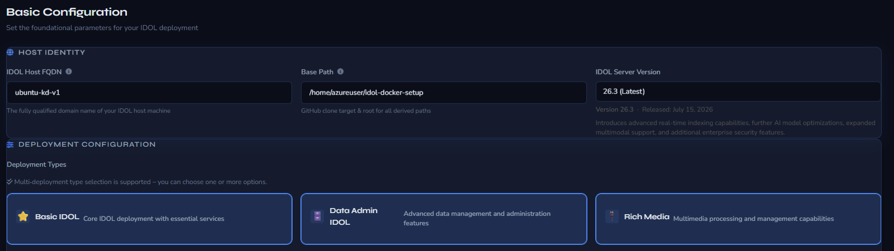
*Screenshot: Basic Configuration — Host Identity (FQDN, Base Path, IDOL Server Version) and Deployment Types selection*

Click **Next: Network**.

#### 5.2 — Network Settings
- Configure the **Host IP Address** and **Guest IP Address** for the container environment.
- Optionally set **Extra IP SANs** (e.g. the public IP of a hyperscaler instance) so that generated SSL certificates include the additional address.
- Review the displayed network verification commands if needed.

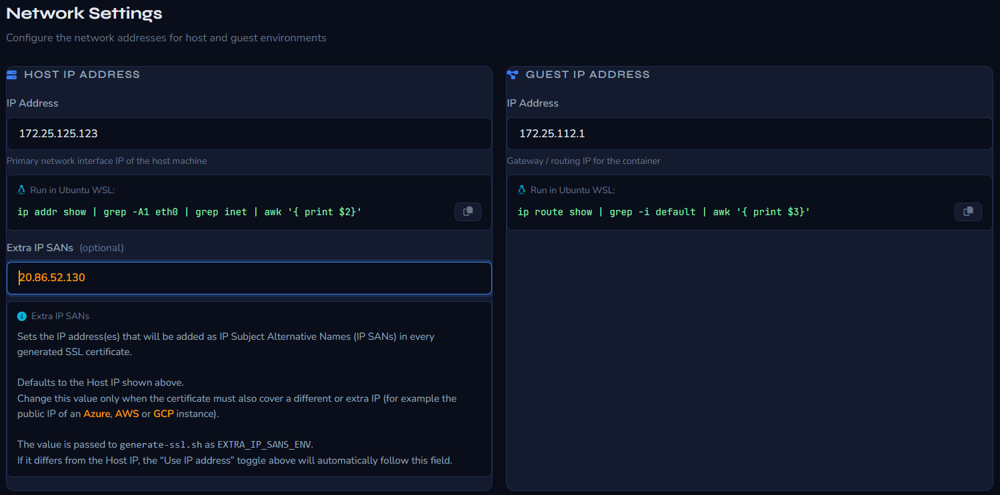
*Screenshot: Network Settings — Host IP, Guest IP, and Extra IP SANs (used for SSL certificate Subject Alternative Names)*

Click **Next: NiFi**.

#### 5.3 — NiFi Configuration

> Complete this step in the Setup Manager UI at **http://localhost:5000/config-idol** (NiFi section).

Configure the following parameters (required fields are enforced by the UI validation before you can proceed):

- **NiFi Deployment Type** *(required)*  
  Select from:  
  - **Full NiFi Version 2** (recommended / default)  
  - Minimal NiFi Version 2  
  - Full NiFi Version 1  
  - Minimal NiFi Version 1  

- **Import Connector NAR Files** *(optional)*  
  - Choose **Yes** or **No** (default: No).  
  - If **Yes**, provide the **Connector Folder Path** (required) — a folder containing `*.nar` files that will be imported into NiFi (e.g. `./persistent-data/nifi-connectors`).

- **Enable GitHub Integration** *(optional)*  
  - Choose **Yes** or **No** (default: No).  
  - **Note:** GitHub Integration requires **Full NiFi Version 2**.  
  - If **Yes**, the following become required:  
    - **GitHub Username**  
    - **GitHub Access Token** (personal access token with repo permissions)  
    - **Repository Name**  

- **Data Preservation** *(strongly recommended)*  
  - **Preserve NiFi Data Outside Container** — Yes (default) / No.  
    - If Yes, set **Preserve NiFi Data Path** (required; auto-populated from Base Path, e.g. `/opt/idol/persistent-data/nifi-data`).  
  - **Preserve NiFi Registry Data Outside Container** — Yes / No (default: No).  
    - If Yes, set **Preserve NiFi Registry Data Path** (required; e.g. `/opt/idol/persistent-data/nifi-registry`).  

> Outside-container preservation ensures data survives container removal or recreation.

Click **Next: Ports**.

#### 5.4 — Ports Configuration
- Click **Check All Ports**.
- Confirm that **all ports are reported as Free**.
- Resolve any conflicts before continuing.

Click **Next: License**.

#### 5.5 — License Server Configuration
- Enter your **License Identity** details (hostname, email, MAC address).
- Provide the **Docker Access Token** for IDOL images.
- Provide the paths to your License Server source folder and `licensekey.dat`.
- Choose the License Server deployment mode (new instance or use existing).

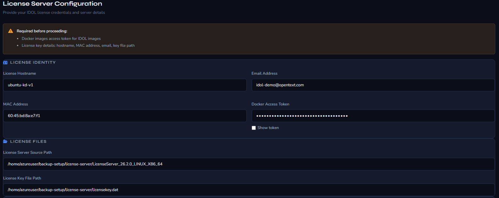
*Screenshot: License Server Configuration — License Identity, MAC Address, Docker Access Token, and License Files paths*

Click **Next: Storage**.

#### 5.6 — Storage & Paths
- Enable **Preserve IDOL Data Outside Container** (strongly recommended).
- Set the persistent data paths for IDOL and NiFi.
- Configure Host Storage Mapping (e.g., hotfolder/ingest directories).

Click **Next: Summary**.

#### 5.7 — Summary & Export
1. Click **Build Pre-Setup Script** to generate `idol-pre-setup.sh`.
2. Click **Continue to Step 2**.
3. Review the **Generated Deployment Command**.
4. Click the **Final Step** button to copy the complete command to your clipboard (and optionally save it).

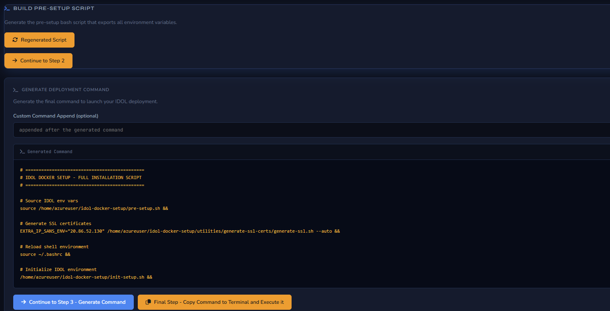
*Screenshot: Summary — Generated Deployment Command including EXTRA_IP_SANS_ENV for SSL certificates and the full installation sequence*

> **Tip:** The copied command handles SSL certificate generation (with any Extra IP SANs you configured), environment setup, and launches all selected IDOL service stacks.

---

### Phase 6 — Deploy IDOL Services

> Paste and run the copied command in your WSL terminal. Then execute the steps below.

#### 6.1 — This copied command should resemble the example deployment sequence shown below.

```bash
# =============================================
# IDOL DOCKER SETUP - FULL INSTALLATION SCRIPT
# =============================================

# Generate SSL certificates
/home/kduser3/idol-docker-setup/utilities/generate-ssl-certs/generate-ssl.sh &&

# Reload shell environment
source ~/.bashrc &&

# Source IDOL env vars
source /home/kduser3/idol-docker-setup/pre-setup.sh &&

# Initialize IDOL environment
/home/kduser3/idol-docker-setup/init-setup.sh &&

# IDOL Preparing Setup Files
cd /home/kduser3/idol-docker-setup/utilities/config-placeholders && ./placeholders-replacement.sh &&

# =============================================
# DEPLOY SELECTED IDOL SERVICES
# =============================================

# Start Basic IDOL
cd /home/kduser3/idol-docker-setup/idol-containers-toolkit/basic-idol && ./deploy.sh up -d &&

# Start Data Admin IDOL
cd /home/kduser3/idol-docker-setup/idol-containers-toolkit/data-admin && ./deploy.sh up -d &&

# Start Rich Media IDOL
cd /home/demo/idol-docker-setup/idol-containers-toolkit/rich-media && ./deploy.sh up -d
```

> Each `./deploy.sh up -d` starts the container stack for that IDOL module in detached mode. Allow 1–2 minutes for all services to initialize.

#### 6.2 — Verify all containers are running

```bash
docker ps
```

All IDOL service containers should appear with status `Up`.

---

**Congratulations!** If all containers are running, your IDOL installation is fully operational. 🎉

---

## Custom Configuration

Customize configurations in the UI before generating the command. For optional manual setups, refer to the sections below.

### NiFi Registry (Optional Manual Setup)

```bash
cd idol-docker-setup/utilities/nifi-registry-setup/
./deploy-nifi-registry.sh up -d
```

### License Server (Optional Manual Setup)

```bash
cd idol-docker-setup/licenseserver-setup/
./deploy-license-server.sh
```

---

## Local LLM Integration

Extend your IDOL deployment with a locally-hosted Large Language Model to enable **Retrieval-Augmented Generation (RAG)** — grounding AI-generated answers entirely in your own indexed content, with no data leaving your environment.

> **Why local?** This setup is ideal for secure, air-gapped, or compliance-sensitive environments where sending data to a cloud LLM is not permitted.

---

### How It Works — IDOL + LLM (RAG)

```
User Query
    │
    ▼
IDOL Content Server  ──────────────────────────────────────────────
│  Semantic search across indexed documents                        │
│  Returns top-N relevant passages (context chunks)                │
└──────────────────────────────────────────────────────────────────┘
    │  Context passages
    ▼
IDOL Answer Server  ───────────────────────────────────────────────
│  Assembles prompt: [System Instruction] + [Context] + [Query]    │
│  Sends to local LLM API endpoint (Ollama)                        │
└──────────────────────────────────────────────────────────────────┘
    │  Assembled prompt
    ▼
Ollama (Local LLM)  ───────────────────────────────────────────────
│  Generates grounded answer using only the provided context       │
└──────────────────────────────────────────────────────────────────┘
    │  Generated answer
    ▼
User — receives a sourced, accurate response
```

IDOL handles **retrieval** (what to know), Ollama handles **generation** (how to say it). The LLM never operates on raw data directly — only on curated passages served by IDOL.

#### Summary — Why IDOL (Knowledge Discovery) + LLM, Together

A standalone LLM is a generalist: fluent and broadly knowledgeable, but blind to your private/internal data and prone to hallucinating or going stale. OpenText Knowledge Discovery (IDOL) is the specialist: it ingests unstructured data — text, audio, video, images — in place across 160+ repositories and 2300+ file types, without migrating anything.

Out-of-the-box, and with no LLM involved at all, IDOL already extracts entities (names, PII/PHI/PCI), auto-categorizes and clusters content (zero-shot), runs rich media analytics (speech-to-text, object/face detection, sentiment), flags sensitive data for GDPR/HIPAA compliance, and maps relationships across content (graphs, timelines, connections).

Pairing the two is where it compounds: IDOL supplies fresh, governed, sourced context; the LLM supplies natural-language fluency, summarization, and reasoning on top of it. That's exactly the RAG flow diagrammed above — IDOL retrieves, Ollama generates, and the result is an answer that's accurate, enterprise-specific, and far less prone to hallucination than either component alone.

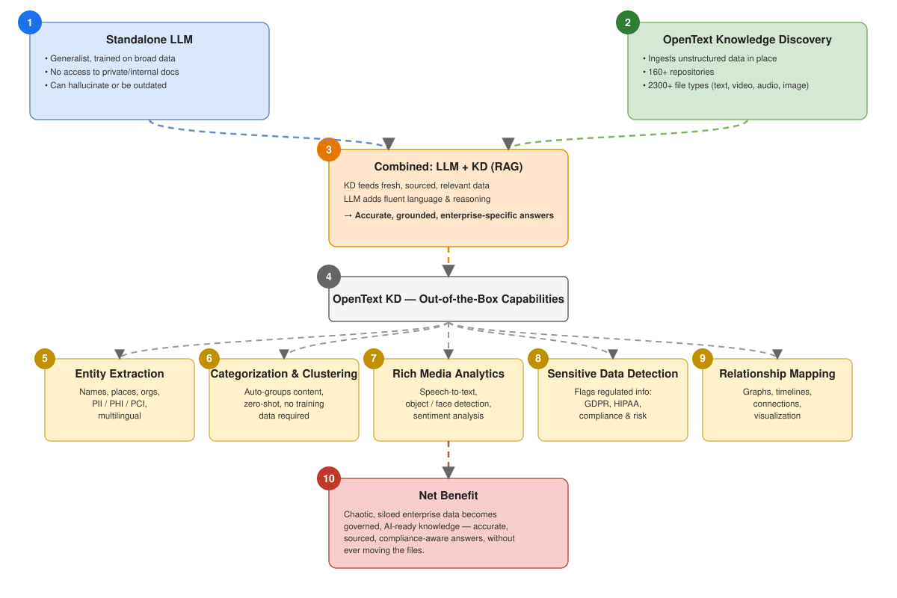
*Diagram 2: How standalone LLM and IDOL Knowledge Discovery combine into the RAG flow — numbered 1–10 to match the explanation above. Editable source: [`idol_kd_llm_rag_insights.drawio`](utilities/info/diagrams/idol_kd_llm_rag_insights.drawio) (open in [diagrams.net](https://app.diagrams.net)).*

---

### Step 0 — Validate Ollama & Hardware (`ollama-verify.sh`)

Before deploying Ollama and pulling models, run the included `ollama-verify.sh` helper script. It checks that Ollama is installed and reachable, inspects your CPU/RAM/GPU, validates every `.gguf` model file in a folder actually loads correctly, and reports the realistic hardware placement (GPU-only, hybrid GPU+CPU, or CPU-only) each model would need — so you can pick a model size that matches your environment *before* wiring it into Answer Server.

#### 0.1 — Run the script

```bash
cd idol-docker-setup/utilities/llm-tools/   # or wherever you place ollama-verify.sh
chmod +x ollama-verify.sh
./ollama-verify.sh
```

You'll be prompted for the folder containing your `.gguf` files. The default is taken from the `IDOL_LLM_MODEL_PATH` environment variable if set, otherwise it falls back to `./llm_models` relative to where you run the script.

```bash
# Optional: point the default at your models folder up front
export IDOL_LLM_MODEL_PATH=/home/demo/idol-docker-setup/persistent-data/llm-sandbox/models
./ollama-verify.sh
```

#### 0.2 — What it checks

- **Ollama reachability** — confirms the `ollama` CLI is installed and the daemon is actually responding, with a clear error and remediation hint if not (e.g. `ollama serve` isn't running).
- **Hardware profile** — CPU, available/total RAM, and GPU (NVIDIA via `nvidia-smi`, AMD best-effort via `rocm-smi`), including real VRAM size when detectable.
- **GGUF integrity** — verifies the file header and that `ollama create` / `ollama run` can actually load and respond using each model.
- **Hardware placement** — for every model, reports whether it will run `GPU only`, `GPU+CPU split` (partial layer offload), `CPU only`, `CPU fallback`, or flags `Insufficient HW` if neither VRAM+RAM nor RAM alone is enough. Run `./ollama-verify.sh --help` for the full legend.
- **Cleanup** — before testing, it unloads any models Ollama already has resident in memory and removes leftover temp models from a previous interrupted run, and pre-warms the OS disk cache per file so timing results are consistent run to run.

#### 0.3 — Acting on the results

- Files reported `INVALID` (bad header or failed to load) should be re-downloaded — they won't work in Step 2 either.
- Use the `GPU`/`MIN RAM` columns to choose a model from [Model Recommendations](#model-recommendations) that actually fits your detected hardware, rather than discovering a poor fit after wiring it into Answer Server.
- At the end of the run, you'll be offered the option to delete any invalid files from the folder.

> **Tip:** Re-run `./ollama-verify.sh` any time you add new `.gguf` files to the folder, or after changing hardware (e.g. adding a GPU), to re-check placement.

---

### Step 1 — Deploy Ollama

Ollama is run as a Docker container on the same Docker network as IDOL so that IDOL Answer Server can reach it by hostname.

#### 1.1 — Add Ollama to the Docker network

Execute `llm-deploy.sh` inside your `idol-docker-setup/persistent-data/llm-sandbox/` folder to deploy llama-demo container.

Sample `llm-docker-compose.yml` content:
```yaml
version: "3.8"
name: llama-demo

services:
  llamacpp-server:
    image: ghcr.io/ggml-org/llama.cpp:server
    ports:
      - 8888:8080
    volumes:
      - ./models:/models
      #- ./answerserver/answerserver.cfg:/answerserver/answerserver.cfg
    environment:
      LLAMA_ARG_MODEL: /models/Mistral-7B-Instruct-v0.3-Q4_K_M.gguf
      # LLAMA_ARG_MODEL: /models/Llama-3.2-3B-Instruct-Q4_K_M.gguf
      # LLAMA_ARG_MODEL: /models/Google-gemma-7b-it.Q4_K_M.gguf
      LLAMA_ARG_ENDPOINT_METRICS: 1 # to disable, either remove or set to 0
```

> **No GPU?** Remove the `deploy.resources` block. Ollama runs on CPU only — expect slower inference but full functionality. For CPU-only, models ≤ 8B parameters are recommended (see [Model Recommendations](#model-recommendations)).

#### 1.2 — Start Ollama

```bash
cd /home/demo/idol-docker-setup
docker compose -f docker-compose.ollama.yml up -d
```

#### 1.3 — Verify Ollama is running

```bash
curl http://localhost:11434/api/tags
# Expected: {"models":[]}  (empty until a model is pulled)
```

---

### Step 2 — Pull a Model

Pull a model into Ollama. The model is downloaded once and stored in the `ollama_data` Docker volume.

```bash
# Pull a model (replace with your chosen model — see recommendations below)
docker exec -it ollama ollama pull llama3.2

# List available models
docker exec -it ollama ollama list
```

Test that the model responds correctly:

```bash
docker exec -it ollama ollama run llama3.2 "Summarize what OpenText IDOL does in two sentences."
```

---

### Step 3 — Configure IDOL Answer Server

IDOL Answer Server connects to Ollama via its OpenAI-compatible REST API. Update the Answer Server configuration to point at Ollama.

#### 3.1 — Locate the Answer Server config

The config file is typically at:

```
/home/demo/idol-docker-setup/idol-containers-toolkit/basic-idol/idol/answerserver/answerserver.cfg
```

#### 3.2 — Add the LLM backend section

Open `answerserver.cfg` and add or update the following section:

```ini
[LLMBackend]
// Use Ollama's OpenAI-compatible endpoint
Type=openai
Host=http://ollama:11434          // Hostname resolves via Docker network
Model=llama3.2                    // Must match the model name pulled in Step 2
APIVersion=v1
APIKey=ollama                     // Ollama does not validate this value; any string works
MaxTokens=2048
Temperature=0.1                   // Low temperature = more factual, less creative
```

Add the LLM backend reference to the Answer Server's system section:

```ini
[Server]
...
LLMBackend=LLMBackend             // Reference the section above
```

#### 3.3 — Configure the RAG Answer System

Also in `answerserver.cfg`, update the Answer System to enable RAG mode:

```ini
[MyAnswerSystem]
Type=retrieval_augmented
LLMBackend=LLMBackend
IDOLHost=idol-content             // IDOL Content Server container hostname
IDOLPort=9100                     // Default IDOL ACI port
NumberOfResults=5                 // Number of IDOL passages to include as context
MaxContextTokens=4096             // Context window passed to the LLM
SystemPrompt=You are an intelligent assistant. Answer questions using only \
             the provided context. If the answer is not in the context, say \
             "I don't have enough information to answer that."
```

#### 3.4 — Restart Answer Server to apply changes

```bash
cd /home/demo/idol-docker-setup/idol-containers-toolkit/basic-idol
docker compose restart answerserver
docker logs answerserver --tail 50    # Confirm clean startup
```

---

### Step 4 — Connect via NiFi Pipeline

For automated document ingestion into IDOL (enabling the LLM to answer questions about your content), configure a NiFi data flow:

#### 4.1 — Typical ingestion pipeline

```
[Data Source]                    [NiFi Flow]                     [IDOL]
File / URL / DB  ──▶  FetchContent ──▶ SplitText ──▶ IndexDocument ──▶ Content Server
```

Key NiFi processors for IDOL RAG:

| Processor | Purpose |
|---|---|
| `FetchFile` / `GetHTTP` | Ingest source documents |
| `SplitText` | Chunk documents into passage-sized segments |
| `AttributesToJSON` | Map metadata (title, source, date) to IDOL fields |
| `PutIDOLDocument` | Index chunks into IDOL Content Server |

#### 4.2 — Access the NiFi UI

Navigate to **http://localhost:8080/nifi** (or the port configured during setup) and import or build your ingestion flow. Use the NiFi Registry for version-controlled flow templates.

---

### Step 5 — Test the Integration

Send a test RAG query directly to IDOL Answer Server via its ACI interface:

```bash
# Basic RAG query — replace HOST and PORT as needed
curl "http://localhost:12000/action=Ask&Text=What+is+IDOL+Content+Server?&AnswerSystem=MyAnswerSystem"
```

Expected response structure:

```xml
<autnresponse>
  <response>SUCCESS</response>
  <responsedata>
    <answer>
      <text>IDOL Content Server is ...</text>
      <source>document_id_123</source>
      <score>0.94</score>
    </answer>
  </responsedata>
</autnresponse>
```

You can also test directly against Ollama's API to verify the LLM is reachable from within the Docker network:

```bash
docker exec -it answerserver curl http://ollama:11434/api/generate \
  -d '{"model":"llama3.2","prompt":"Hello, are you working?","stream":false}'
```

---

### Model Recommendations

Choose a model based on your hardware profile. All models below run on CPU if no GPU is available, though response time will increase.

| Model | Size | VRAM / RAM | Strengths | Best For |
|---|---|---|---|---|
| `llama3.2` | 3B | ~4 GB | Fast, low resource | Development, testing |
| `llama3.1:8b` | 8B | ~8 GB | Strong reasoning | General RAG, Q&A |
| `mistral:7b` | 7B | ~7 GB | Instruction-following | Summarization, extraction |
| `gemma2:9b` | 9B | ~10 GB | Multilingual, factual | Enterprise knowledge bases |
| `llama3.1:70b` | 70B | ~48 GB | Near-GPT-4 quality | Production, high-accuracy RAG |
| `nomic-embed-text` | — | ~1 GB | Embeddings only | Semantic search boosting |

> **Tip:** For best RAG quality, pair a mid-size generative model (e.g., `llama3.1:8b`) with `nomic-embed-text` for re-ranking IDOL results before passing them to the LLM.

To switch models, update the `Model=` value in `answerserver.cfg` and pull the new model:

```bash
docker exec -it ollama ollama pull mistral:7b
# Then update answerserver.cfg and restart answerserver
```

## Rich Media Processing
 
Extend your IDOL deployment with a locally-hosted **Media Server** to enable intelligent analysis of images, video, and audio — grounding all processing entirely within your own infrastructure, with no media leaving your environment.
 
> **Why local?** This setup is ideal for secure, air-gapped, or compliance-sensitive environments where sending media assets to a cloud provider is not permitted.
 
---
 
### How It Works — IDOL + Rich Media Pipeline
 
```
Ingest Source (video / image / audio)
    │
    ▼
NiFi Media Ingest  ────────────────────────────────────────────────
│  Receives and routes incoming media streams or files             │
│  Triggers analysis workflows via configured processors           │
└──────────────────────────────────────────────────────────────────┘
    │  Raw media frames / clips
    ▼
IDOL Media Server  ────────────────────────────────────────────────
│  Runs pretrained model inference (face, object, speech, scene)   │
│  Extracts structured metadata and analysis results               │
└──────────────────────────────────────────────────────────────────┘
    │  Structured metadata output
    ▼
IDOL Content Server  ──────────────────────────────────────────────
│  Indexes extracted metadata for search and retrieval             │
│  Associates results back to source media references              │
└──────────────────────────────────────────────────────────────────┘
    │  Indexed, searchable rich media records
    ▼
User — queries and retrieves media by content, not just filename
```
 
NiFi handles **ingestion and routing** (what comes in), Media Server handles **analysis** (what it means), and IDOL Content Server handles **indexing** (how it's found). Raw media is never sent externally — all inference runs on your locally-hosted models.
 
---
 
### Deploy IDOL Media Server
 
Media Server is run as a Docker container on the same Docker network as IDOL so that NiFi and Content Server can reach it by hostname.
 
#### Add Media Server to the Docker network
 
Execute `richmedia-deploy.sh` inside your `idol-docker-setup/persistent-data/rich-media-sandbox/` folder to deploy the `rich-media-demo` container.
 
Sample `richmedia-docker-compose.yml` content:
 
```yaml
version: "3.8"
name: rich-media-demo
services:
  mediaserver:
    image: idol-media-server:26.1.0
    ports:
      - 14000:14000   # ACI port
      - 14001:14001   # Service port
    volumes:
      - ./models:/mediaserver/models
      - ./config:/mediaserver/cfg
    environment:
      IDOL_MEDIASERVER_VERSION: "26.1.0"
      PRETRAINED_MODELS_PATH: /mediaserver/models/MediaServerPretrainedModels_26.1.0_COMMON
      # FACE_RECOGNITION_ENABLED: "true"
      # OBJECT_DETECTION_ENABLED: "true"
      # SPEECH_TO_TEXT_ENABLED: "true"
```
 
> **No GPU?** Remove the `deploy.resources` block. Media Server runs on CPU only — expect slower inference but full functionality. For CPU-only deployments, limit concurrent analysis channels and prefer lighter model configurations (see [Model Recommendations](#model-recommendations)).
 
#### Start Media Server
 
```bash
cd /home/demo/idol-docker-setup
docker compose -f richmedia-docker-compose.yml up -d
```
 
---
 
### Summary of Parameters
 
| Parameter | Required | Example Value |
|---|---|---|
| IDOL Server Version | Yes | `26.1` |
| NiFi Media Server Unzip Package Location Path | Yes | `/home/kduser3/rich-media-software/NiFiMediaServer_26.1.0_LINUX_X86_64` |
| Enable Media Server Pretrained Models | Optional | Enabled |
| Pretrained Models Location Path | If enabled | `/home/kduser3/rich-media-software/MediaServerPretrainedModels_26.1.0_COMMON` |
 
---

## NiFi Manager Configuration

After the core IDOL services are running, use the **NiFi Manager** screens in the Setup Manager UI to connect to NiFi, import flow definitions, manage Parameter Contexts, and enable Controller Services.

> These screens are typically reached from the main dashboard via **Open NiFi Config** (or directly at the NiFi configuration route served by the Setup Manager).

### NiFi & GitHub Connection

Configure the NiFi API endpoint and optional GitHub repository integration used by the NiFi Registry / Flow Registry Client.

- **NiFi API URL** — Use the public IP (or FQDN) of the host together with the secured NiFi port, e.g. `https://20.86.52.130:8443/nifi-api`.
- **Username / Password** — Default admin credentials (or the values you set during deployment).
- Click **Test NiFi Connection** — the status badge should show **REACHABLE**.
- Optionally fill in GitHub API URL, Repository Owner, Repository Name, Personal Access Token, and Default Branch, then test the GitHub connection.

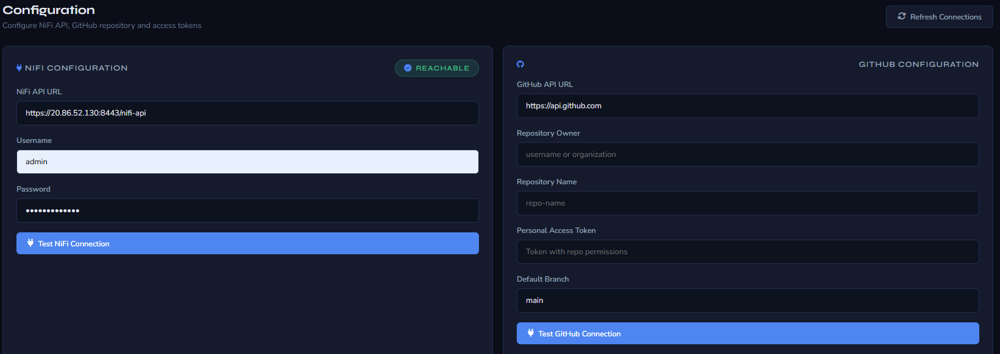
*Screenshot: NiFi Configuration (API URL pointing at the hyperscaler public IP) and GitHub Configuration panels*

### Import NiFi Flows

Scan a folder (or drag-and-drop) containing NiFi flow definition files (`.json`, `.xml`, `.flow`, `.template`). Select the flows you want to import into the running NiFi instance.

- Supported formats are listed in the upload pane.
- Use **ROOT / Select** to choose which flows become the process-group roots.
- Optionally enable **Clear all existing NiFi flows before importing** (destructive) before clicking **Reset NiFi Flows & Import Selected**.

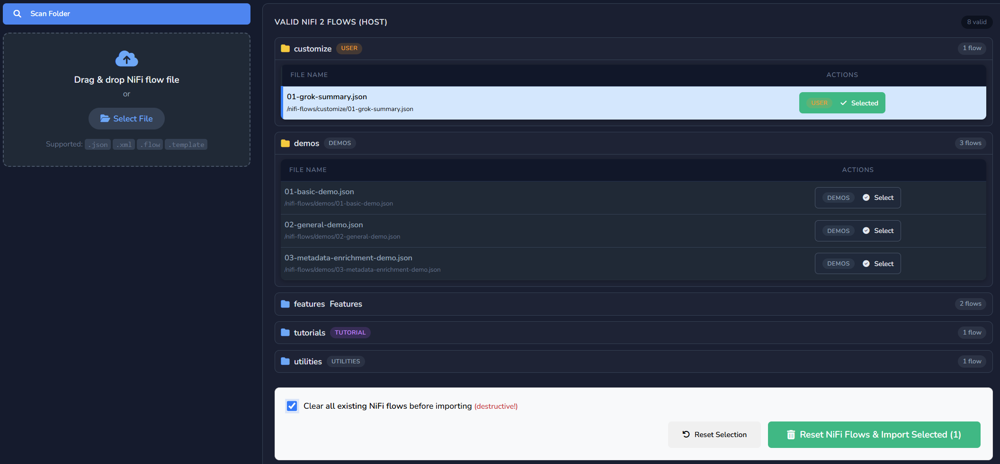
*Screenshot: Valid NiFi 2 Flows (HOST) — select and import flow definitions (e.g. Basic_Demo.json)*

### Parameter Contexts

View, create, edit, or delete NiFi Parameter Contexts. Contexts hold reusable parameters (license server settings, SSL certificate paths, connector credentials, etc.) that flows reference.

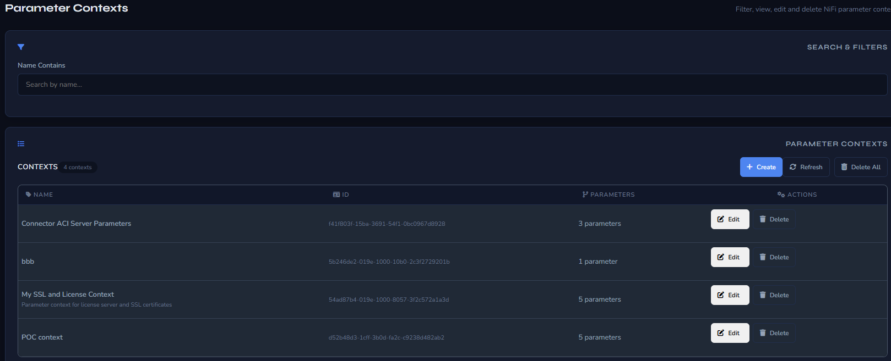
*Screenshot: Parameter Contexts list — Connector ACI Server Parameters, SSL and License Context, POC context, etc.*

### Controller Services

Manage NiFi Controller Services (License Service, KeyView Filter, SSL Config Service, …). Enable, disable, edit, or bulk-operate on services required by the imported flows.

- Services that show **INVALID** usually need their parameters (or the linked Parameter Context) corrected before they can be enabled.
- Use **Bulk Enable** once all required services validate successfully.

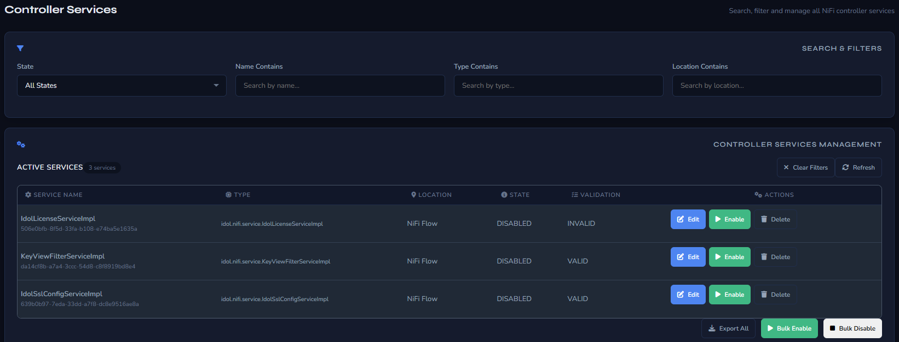
*Screenshot: Controller Services management — IdolLicenseServiceImpl, KeyViewFilterServiceImpl, IdolSslConfigServiceImpl*

---

## Troubleshooting

### Remove All Running Containers

Force-remove every running container (useful for a clean re-deploy on a remote instance):

```bash
docker rm -f $(docker ps -q)
```

> **Warning:** This stops and deletes *all* containers on the host. Use only when you intentionally want a full reset.

### Verify Extra SAN IP in NiFi Certificate

After SSL certificate generation (or when the public IP of a hyperscaler instance changes), confirm that the extra Subject Alternative Name (SAN) IP is present in the NiFi certificate:

```bash
echo | openssl s_client -connect 20.86.52.130:8443 -servername 20.86.52.130 2>/dev/null | openssl x509 -noout -text | grep -A1 "Subject Alternative Name"
```

Replace `20.86.52.130` with the public IP of your remote Linux instance. A successful result will list the IP (and any DNS names) under `Subject Alternative Name`.

### Port 7000 Already in Use

```bash
sudo lsof -i :7000
sudo kill -9 <PID>
```

### Docker Permission Denied

```bash
sudo usermod -aG docker $USER
newgrp docker
```

### Docker `credsStore` Error on WSL

Remove the Windows credential helper from `~/.docker/config.json` (see [Phase 2, Step 2.7](#27--fix-docker-credential-store-for-wsl)).

### License Server Not Found

- Verify the `licensekey.dat` path is correct.
- Check the license server container is running: `docker ps | grep license`
- Review logs: `docker logs idol-license-server`

### NiFi GitHub Flow Registry Client


*Video 2: How to configure NiFi GitHubFlowRegistry Client*

### WSL Memory Issues

Edit `%UserProfile%\.wslconfig` on Windows and increase memory/processor allocation:

```ini
[wsl2]
memory=64GB
processors=8
```

Restart WSL: `wsl --shutdown`

### Ollama Not Reachable from IDOL Answer Server

Verify both containers are on the same Docker network:

```bash
docker inspect ollama | grep -A5 Networks
docker inspect answerserver | grep -A5 Networks
# Both should show the same network name (e.g., idol_network)
```

If they are on different networks, update `docker-compose.ollama.yml` to reference the correct `external` network name.

### LLM Returns Empty or Irrelevant Answers

- Confirm the model name in `answerserver.cfg` exactly matches the pulled model name (`docker exec -it ollama ollama list`).
- Lower `Temperature` to `0.0` for strictly factual responses.
- Increase `NumberOfResults` to give the LLM more context passages.
- Check Answer Server logs: `docker logs answerserver --tail 100`

### Ollama Model Download Fails

Ollama pulls models from the internet. If your environment is restricted:

```bash
# Check egress from within the Ollama container
docker exec -it ollama curl -I https://ollama.com
```

If blocked, pre-download the model on a connected machine and import via:

```bash
ollama pull llama3.2
# Copy the ~/.ollama directory to your server and mount it as the ollama_data volume
```

### High Memory Usage / OOM Kills

- Switch to a smaller model (e.g., `llama3.2` 3B instead of `llama3.1:8b`).
- Set `OLLAMA_NUM_PARALLEL=1` in the Ollama container environment to limit concurrent inference.
- Increase WSL2 memory allocation in `.wslconfig` (see [WSL2 Performance Tuning](#wsl2-performance-tuning-windows-users)).

### Getting Help

- Check the [Issues](https://github.com/oattia-ot/idol-docker-setup/issues) page.
- Review Docker container logs: `docker logs <container-name>`

---

## Acknowledgments

Deep gratitude to **[Vinay Joseph](https://www.linkedin.com/in/vinayjoseph/)** for exceptional technical mentorship and collaboration throughout this project's development. Your expertise and guidance were instrumental in delivering this enterprise-grade solution.
 
Special thanks to **[Chris Blanks](https://www.linkedin.com/in/chris-blanks-403a824)** for his valuable contributions to the IDOL community through a wealth of practical GitHub repositories, including hands-on IDOL tutorials and reference implementations that served as an essential resource throughout the development of this project.

### Development Team

**Oren Attia** — Solution Consulting
[LinkedIn: Oren Attia](https://www.linkedin.com/in/oren-attia)

---

## License

This project operates under OpenText IDOL licensing agreements.

---

**OpenText IDOL Docker Deployment** | Made with ❤️ for the IDOL Community

[](https://www.opentext.com/products/idol)
